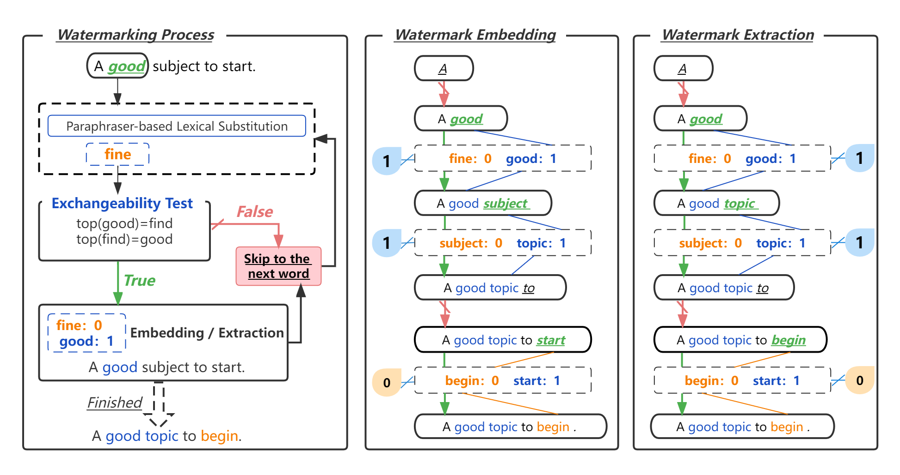

# Natural Language Watermarking via Paraphraser-based Lexical Substitution

   Watermarking is one of the existing prominent techniques on tracing text
provenance. It is implemented by covertly embedding watermark signals into
an object (image, audio, text) that is helpful to track the ownership of the
object. In this paper, we propose a novel lexical substitution (LS) method 
based on a paraphraser, and utilize it to design our watermarking method: 




### Dependecies
- Python>=3.6
- torch>=1.7.1
- transformers==4.9.2
- fairseq==0.10.2


### Pre-trained model
- [ParaLS](https://github.com/qiang2100/ParaLS) (the proposed novel lexical substitution (LS) method)
- [BLEURT](https://github.com/google-research/bleurt) (bleurt-large-512)
- [BARTScore](https://github.com/neulab/BARTScore)
- [BERTScore](https://pypi.org/project/bert-score/0.2.1/)

### Dataset
- [three novels](https://www.gutenberg.org/) (Wuthering Heights”, “Dracula”, and “Pride and Prejudice)
- [others](https://huggingface.co/datasets) (WikiText-2, IMDB, and NgNews)


## Obtain synonym set through ParaLS
```shell
# You can find the possible replacement word set by this command specifying the target word and the target word to be replaced.
python LSPara_Multi_with_bart_until_target_no_suffix.py en2en 'A good subject to start.' 'good' 2 20 
```

## Embedding and Extract watermarks 
```shell
python run_watermark_no_substitutable.py
```

## Calculate Payload and Recoverability by counting the number of watermarks
```shell
python calculate_others.py
```

## Citation
```
@article{qiang2022chinese,
    title={Natural Language Watermarking via Paraphraser-based Lexical Substitution},
    author={Jipeng Qiang, Shiyu Zhu, Yun Li, Yi Zhu, Yunhao Yuan, Xindong Wu},
    journal={Artificial Intelligence},
    year={2022},
}
```
